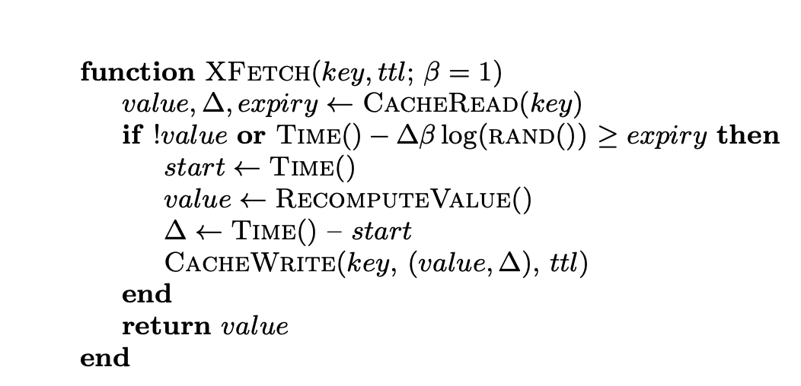

# 캐시 스탬 피드 

캐시 life cycle  : 생성 -조회 - 만료의 생명주기를 가짐.
만약 캐시가 만료되어 새로운 캐시를 가져오는 시점에 순간적으로 DBMS에 읽기 요청이 집중되고 , 중복된 쓰기 요청을 야기하면 어떡하지 ?

→ 해결 방법: 만료 전 배치로 재성성 or 마지막 이벤트만 실행하도록 debounce 개념을 도입, 확률에 의거한 PER 알고리즘 

## PER 알고리즘 

여러 프로세스(스레드)가 동시에 “새로운 캐시를 채우기 위해 만료 직후 요청”을 보내는 사태(스탬피드)가 일어나지 않도록, 
캐시 갱신 시점을 적절히 랜덤화하는 기법.

